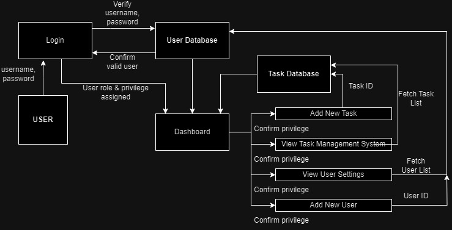
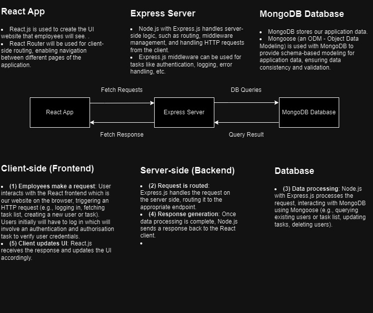
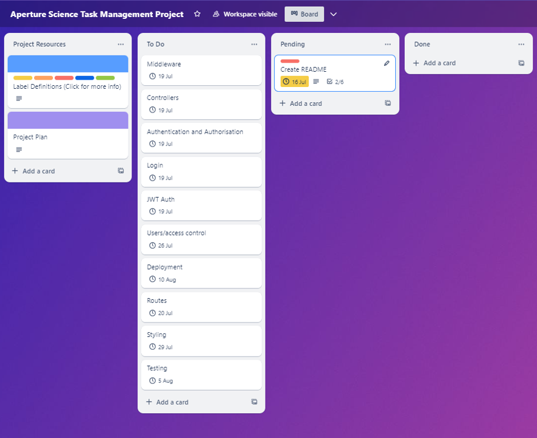
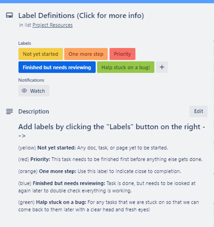
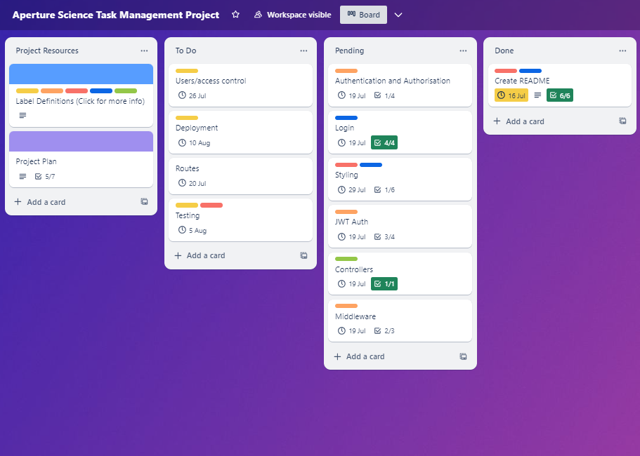
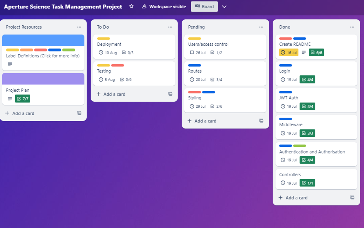
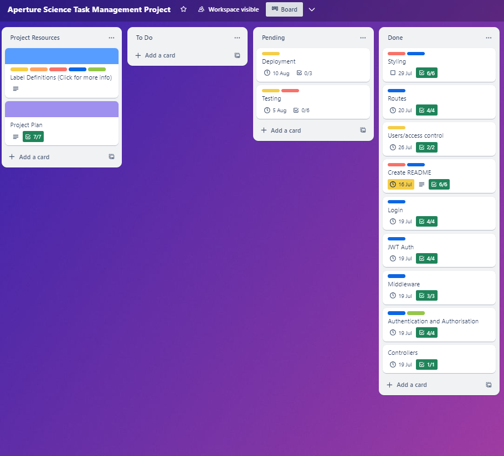
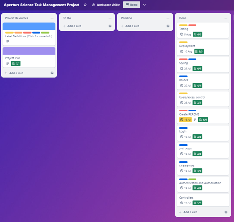

# Aperture Science Task Management System

 

  

## Description

This application is a task management system to replace an outdated post-it note system for the entity Aperture Science, Inc.

### Purpose

The application will provide a public facing webpage that will allow for employee login, roles to be assigned with corresponding privileges and allow the employees to access the task management system, interacting with it appropriately based on their level of privileges.

### Functionality / features

The application will provide a robust front facing web page that reflects that of the companies' values. It will feature an employee login that will assign privileges to the user to determine level of access. It will allow users to create/edit/delete/assign tasks depending on their level of privilege. It will feature a responsive design that will allow the webpage to be displayed appropriately on different common screen sizes.

### Target audience

Aperture Science Incorporated, formally Aperture Fittings a shower curtain manufacturer, has evolved and moved into the realm of experimental physics research institution and as such they need to replace their archaic post-it note task management system. Aperture Science CEO Cave Johnson has commissioned a modernised application that will provide an elegant and efficient solution to their project tasking needs and be reflective of his companies' values and 3 pillars.

#### Aperture Science 3 Pillars

- Pillar one: Science without results is just witchcraft.
- Pillar two: Get results or you're fired.
- Pillar three: if you suspect a coworker of bein' a witch, report them immediately. I cannot stress that enough. Witchcraft will not be tolerated.

### Tech stack

- MongoDB
- Express.js
- React.js
- Node.js

## Dataflow Diagram

## Application Architecture Diagram

## User Stories

### Cave Johnson - Founder and CEO

- I want a modern task management application instead of having to use post it notes
- Notes should be assigned to managers only
- I want a modern website that my customers can see that reflects our values
- I need to be able to remove an employee immediately if required

UPDATE: Notes should be assigned to whichever employee is completing task

- Notes should be assigned to anyone

### Doug Rattmann - Programmer and Technician

Employees should be separated into Employees and Managers, managers have higher privileges

UPDATE: Employees, Managers and Admin needed

- Managers and admins should have higher privileges than employee role

### Henry - Technician

- I want notes to be able to be assigned to individuals
- Everyone should be able to access notes
- Only Managers should create notes

UPDATE: Everyone should be able to create notes

- All users once signed in should be able to create notes

### Caroline - Admin

- I want something that is easy to navigate to make my work easier
- I don't have a mobile so I want this designed for desktop only
- I would like notes to have a ticket number which makes it easier for me to track completed or new tasks

UPDATE: app should be usable on other screen sizes but prioritise desktop

- app should be responsive, prioritising desktop

### GLaDOS - Researcher

- I want to make sure employees are logging in and not exploiting this work from home malarkey
- Website must be secure, users will need to be authorised before they can see anything of importance other than the front facing website

### Wheatley - HR

- Only Managers and admin roles should be able to access settings or create new users

### Consolidated Tasks based off User Stories

- Replace current post-it note system
- Add a public facing page with basic contact info
- Add an employee login to the app
- Provide a welcome page after login
- Provide easy navigation
- Display current user and assigned role
- Provide a logout option
- Require users to login at least once per week
- Provide a way to remove employee access asap if needed
- ~~Notes are assigned to managers only~~
- Notes are assigned to specific employees
- Notes have a ticket #, title, note body, created & updated dates
- Notes are either OPEN or COMPLETED
- ~~Users can be Employees or Managers~~
- Users can be Employees, Managers, or Admins
- Notes can only be deleted by Managers or Admins
~~Only managers can create notes~~
- Anyone can create a note
- Employees can only view and edit their assigned notes  
- Managers and Admins can view, edit, and delete all notes
- Only Managers and Admins can access User Settings
- Only Managers and Admins can create new users
- ~~App must be desktop only~~
- Must be responsive and accessible different screensizes, but primarily designed for desktop

## Wireframes

### Homepage

### Login

### Dashboard

### View Tasks

### New Tasks

### Employees

### New User

## Trello Board

